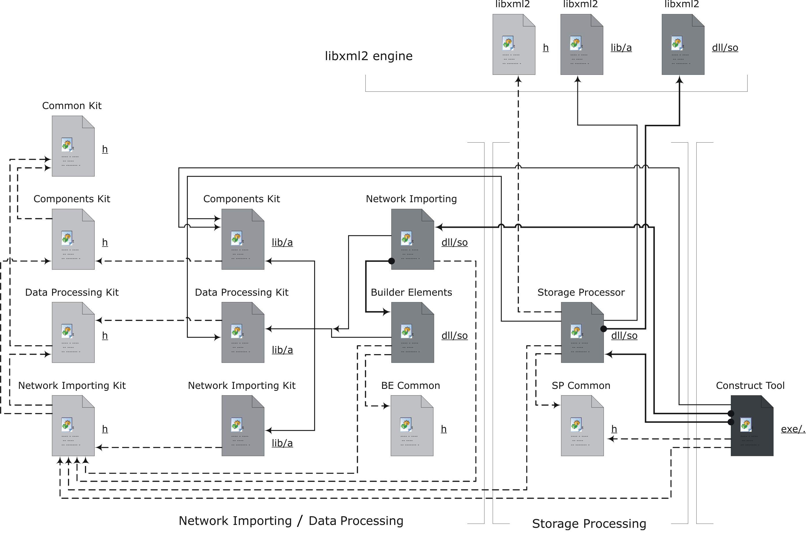

# Neuro Laboratory

## Introduction

There is special place in my heart for **Neuro Laboratory** project. 
Ages ago it was built. My views on technology and tooling I use have changed rather drastically.
And yet it was the first commercial product I designed, built and brought to market
and some of the ideas behind still sound very appealing to me. 

There is a lot of hype around machine learning these days.
It was much quieter back in the day when I worked on my Master Thesis and used ANNs as a foundation of my research. 
Back then I did not even know that multilayer perceptrons with sigmoid activation function I used quite a lot
were actually _deep_ neural networks.

It has been about 10 years since the last major contribution was made to the code base.
At some point I decided to abandon research work and switch entirely to engineering aspects of software development.
This was one of key factors that had put an end to the project. 
Looking back (and knowing what I know now) I would have made the same decision again.

Scientific research and software design activities are significantly different in nature.
I did not mind and even enjoyed chaotic nature of experimentation with ANN models, mixing training methods and 
analyzing data in search for achieving desired classification accuracy. 
But at the same time I'm glad I realized early on that my true passion belongs to a very structured and organized
process of defining architecture of a software system and tracking its evolution from a concept all the way through
to production-grade solution.  

I do believe that the work on this project - a suite of tens of components with nearly hundred thousand lines of code -
helped me to understand that and to some extend defined initial vector of my career. 

**October, 2017**

## Disclaimer

The project is no longer developed and maintained.  
Its source code is provided "as is", without warranty of any kind.  

**December, 2007**

## Overview 

**Neuro Laboratory** is a suite of software components aiming to simplify all phases of a neural network lifecycle.  
It comes with an IDE for designing and training neural network models and 
SDK allowing trained models to be loaded for the purpose of processing data.  

## Major Milestones

The project was being actively developed during **2004-2007** time frame.  
 
- **December, 2004** | The work on initial prototype has begun.
- **June, 2005** | Neuro Laboratory 0.9 and initial web site were released.  
- **September, 2005** | Neuro Laboratory 1.0 was released. 
- **January, 2006** | Fully functional web site was [launched](http://scientific-soft.com/).
- **August, 2006** | Neuro Laboratory 1.1 was [released](manuals/Neuro%20Laboratory%20-%20Press%20Release%201.1/Professional%20Edition.pdf). 

## Project Components

### Neuro Laboratory Environment 

The heart of the product is visual neural network editor where 
network models of desired topology can be constructed from scratch, trained and validated.   

The entire IDE functionality is implemented in the form of extensions of three major types:

- _Network Elements_
- _Network Trainers_
- _Plugins_

IDE defines public interfaces of all those modules allowing those to be added without affecting system core. 
IDE itself provides ANN representation, implements data processing engine and network persistence. 

For instance, this simple single layer network

has the following internal representation

#### Network Elements

The collection of _network elements_ provides building blocks for constructing network models.

The following groups of elements are available out of the box: 

- Data Flow Elements (Input, Constant Input, Input Factory, Output, Output Factory);
- Data Processors (Neuron);
- Layers (Hopfield Layer, Neurons Layer, RBF Layer, Winner Layer);
- Edge Detectors (Canny Detector);
- PCA Block Set (PCA Transform);
- Scripting Extension (Scripting Element);
- Signal Processors (FFT Processor).

Each element transforms data it takes as an input and propagates it to element's outputs. 

_Layers_ is a group of network elements that are organized and act as layers of neurons. 
These elements have activation function associated with it and store weights as a part of its state.     

#### Network Trainers

_Network Trainers_ represent another category of **Neuro Laboratory** extensions.
Each trainer implements a specific method of adjusting network model properties (most commonly neuron weights).

**Neuro Laboratory** comes with these algorithms implemented:  

- Back Propagation
- Back Propagation (powered by [FANN library](LIBS.md))
- Kohonen Trainer
- PCA Trainer
- RDF Trainer

#### Plugins

_Plugins_ is a generic mechanism for extending functionality of **Neuro Laboratory**.     

Example plugins included in default installation: 

- Layers Exporter - allows exporting layer weights;
- Process Network - executes network processing, allows specifying input data and displays the output; 
- Scripting Environment - **Lua**-based scripting platform. 

##### Scripting Environment

_Scripting Environment_ integrates **Lua** interpreter and provides bindings to all internal system interfaces 
(network model, network elements, network trainers). 
This provides developers and researches with easy access to network internals.   

The tool can be used for experimenting with custom training algorithms, automating classification quality verification, etc.  

It also comes with a number of visualization primitives allowing to represent experiment results and 
intermediate debug data appropriately. 

### Network Importing SDK 

One of the key components of the solution is the SDK enabling application developers with easy access to 
previously designed and trained models.  

The SDK comes with dynamic libraries built for Windows and Linux systems. 

#### Areas Builder 

_Areas Builder_ is a sample project included in the SDK package to demonstrate loading network model and 
processing data with it. 

The app is linked against SDK and contributes with its own project serialization model that combines 
trained network along with sample data it can be tested against (in this case multispectral satellite image).

_Areas Builder_ illustrates the use of ANN as a classifier.
Network models packages with the tool are trained to detect specific features within satellite images. 
The tool comes with a set models trained for detecting features within an image.  

The tool splits input image into chunks and passes each of those through trained model 
building a number of maps each corresponding to a feature the model is trained to recognise. 

Here are the results of an experiment with original 3-layered image on the left and 4 feature maps on the right. 

### scientific-soft.com

The web site was launched as a platform for distributing commercial package and accompanying documentation.  

## Research 

**Neuro Laboratory** toolbox was developed and used as a platform for conducting research in the area of remote sending, 
multispectral satellite images processing and optical characters recognition. 

Most of the experiments were performed with the use of RBF layers, multilayer perceptrons and combinations of those. 
Different methods of data pre processing were adopted (e.g. histogram representation of imagery data,
Canny edge detector/FFT in digit recognition models).

See these publications for details of those experiments and achieved results:   

- [Multispectral Satellite Images Processing for Forests and Wetland Regions Monitoring Using Parallel MPI Implementation](research/articles/envisat-2007.pdf) | Envisat Symposium 2007 | Apr 23, 2007 
- [Processing the Multispectral Satellite Images Using RBF-based Neural Network](research/articles/imvip-2006.pdf) | Irish Machine Vision and Image Processing Conference | Aug 30, 2006

## References

Project Home - http://scientific-soft.com

## Downloads 

Latest release is available for free download here: 
[Neuro Laboratory 1.1 Professional Edition](http://scientific-soft.com/download/NeuroLab11Pro.zip).

Commercial package of **Neuro Laboratory** is no longer being distributed. 

## License

Code is licensed under the [The MIT License](http://opensource.org/licenses/MIT).   
Documentation is licensed under [Creative Commons Attribution 4.0 International License](https://creativecommons.org/licenses/by/4.0/).
