# Neuro Laboratory

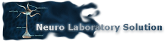

## Introduction

There is special place in my heart for **Neuro Laboratory** project. 
Ages ago it was built. My views on technology and tooling I use have changed rather drastically.
And yet it was the first commercial product I designed, built and brought to market
and some of the ideas behind still sound very appealing to me. 

There is a lot of hype around machine learning these days.
It was much quieter back in the day when I worked on my Master Thesis and used ANNs as a foundation of my research. 
Back then I did not even know that multilayer perceptrons with sigmoid activation function I used quite a lot
were actually _deep_ neural networks.

It has been about 10 years since the last major contribution was made to the code base.
At some point I decided to abandon research work and switch entirely to engineering aspects of software development.
This was one of key factors that had put an end to the project. 
Looking back (and knowing what I know now) I would have made the same decision again.

Scientific research and software design activities are significantly different in nature.
I did not mind and even enjoyed chaotic nature of experimentation with ANN models, mixing training methods and 
analyzing data in search for achieving desired classification accuracy. 
But at the same time I'm glad I realized early on that my true passion belongs to a very structured and organized
process of defining architecture of a software system and tracking its evolution from a concept all the way through
to production-grade solution.  

I do believe that the work on this project - a suite of tens of components with nearly hundred thousand lines of code -
helped me to understand that and to some extend if not shaped than at least defined initial vector of my career. 

**October, 2017**

## Disclaimer

The project is no longer developed and maintained. 
Its source code is provided "as is", without warranty of any kind.  

**December, 2007**

## Overview 

**Neuro Laboratory** is a suite of software components aiming to simplify all phases of a neural network lifecycle.      

## Major Milestones

The project was being actively developed during **2004-2007** time frame.  
 
- **December, 2004** | The work on initial prototype has begun.
- **June, 2005** | Neuro Laboratory 0.9 and initial web site were released.  
- **September, 2005** | Neuro Laboratory 1.0 was released. 
- **January, 2006** | Fully functional web site was [launched](http://scientific-soft.com/).
- **August, 2006** | Neuro Laboratory 1.1 was [released](manuals/Neuro%20Laboratory%20-%20Press%20Release%201.1/Professional%20Edition.pdf). 

## Project Components

### Neuro Laboratory Environment 

The heart of the product is visual neural network editor.

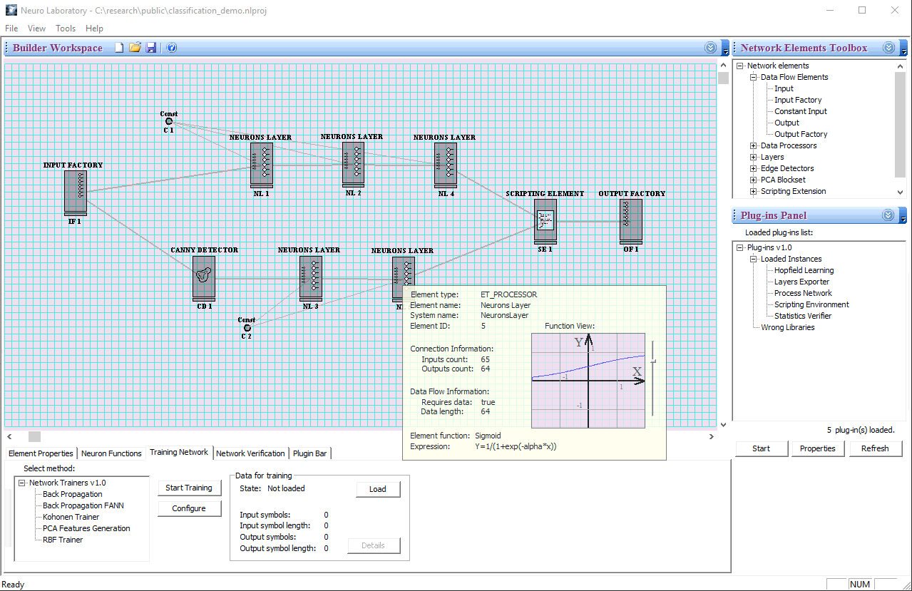

#### Network Elements

- Data Flow Elements (Input, Constant Input, Input Factory, Output, Output Factory);
- Data Processors (Neuron);
- Layers (Hopfield Layer, Neurons Layer, RBF Layer, Winner Layer);
- Edge Detectors (Canny Detector)
- PCA Block Set (PCA Transform)
- Scripting Extension (Scripting Element)
- Signal Processors (FFT Processor)

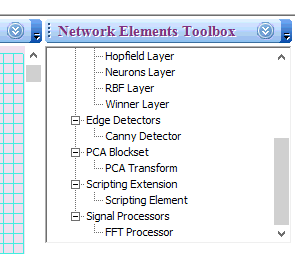

#### Trainers

- Back Propagation
- Back Propagation (powered by [FANN library](LIBS.md))
- Kohonen Trainer
- PCA Trainer
- RDF Trainer

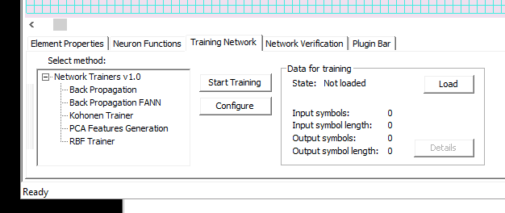

#### Plugins

- Layers Exporter
- Process Network
- Scripting Environment

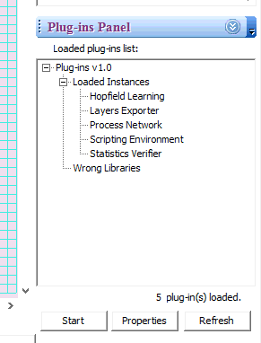

##### Scripting Environment

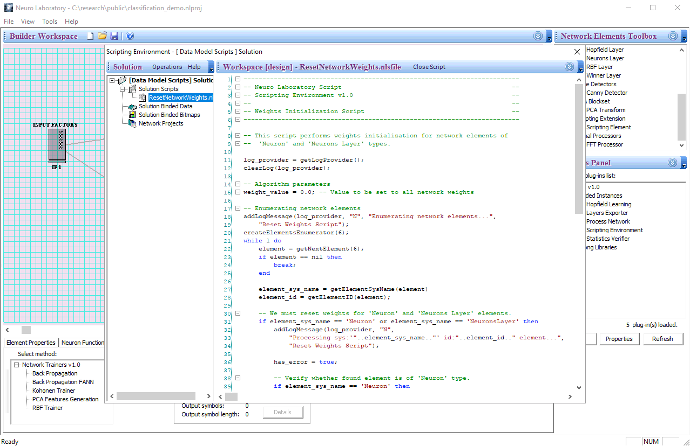

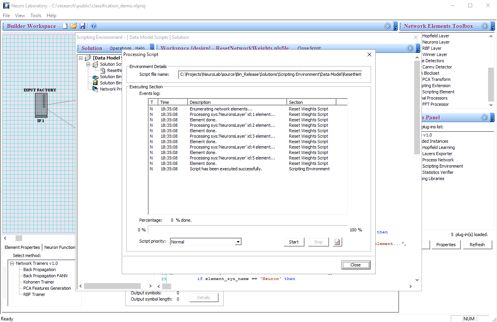

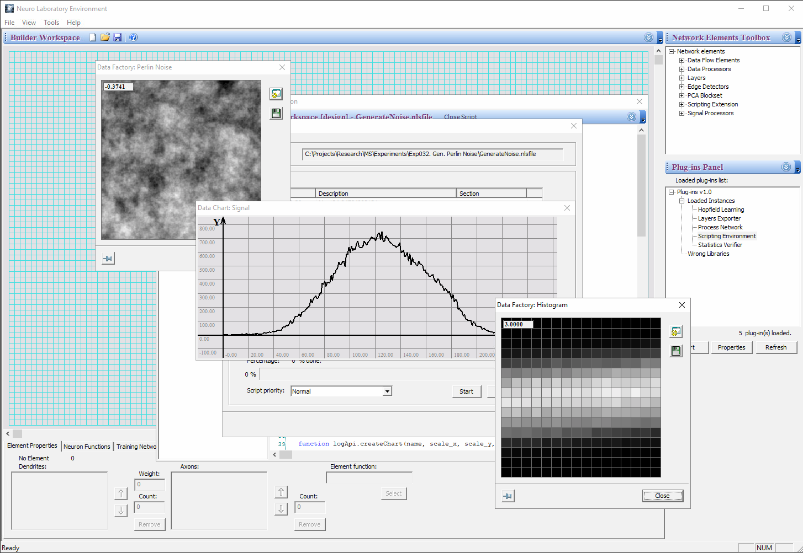

### Network Importing SDK 

#### Areas Builder Sample Project 

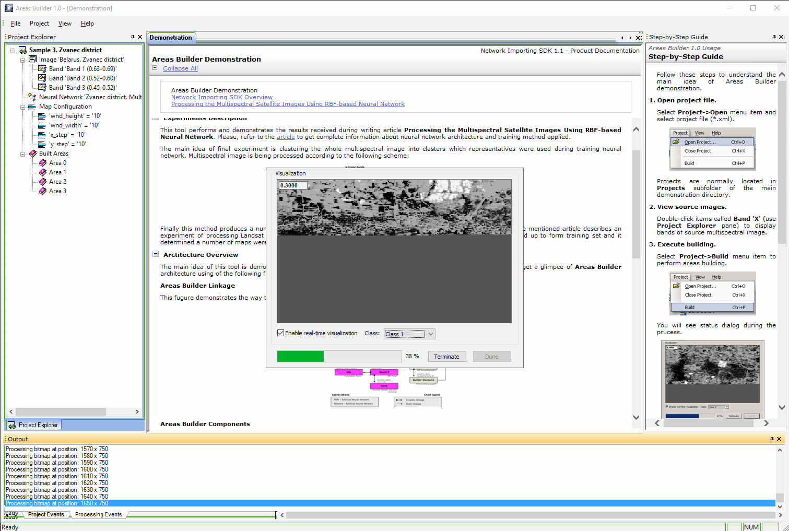

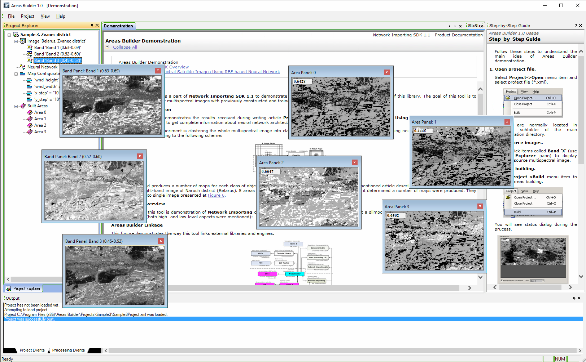

### scientific-soft.com

The web site was launched as a platform for distributing commercial package and accompanying documentation.  

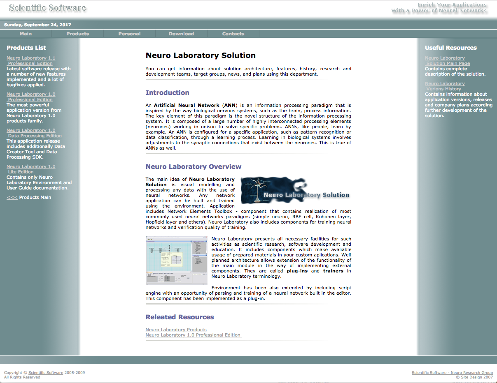

## Research 

**Neuro Laboratory** toolbox was developed and used as a platform for conducting research in the area of remote sending, 
multispectral satellite images processing and optical characters recognition. 

Most of the experiments were performed with the use of RBF layers, multilayer perceptrons and combinations of those. 
Different methods of data pre processing were adopted (e.g. histogram representation of imagery data,
Canny edge detector/FFT in digit recognition models).

See these publications for details of those experiments and achieved results:   

- [Multispectral Satellite Images Processing for Forests and Wetland Regions Monitoring Using Parallel MPI Implementation](research/articles/envisat-2007.pdf) | Envisat Symposium 2007 | Apr 23, 2007 
- [Processing the Multispectral Satellite Images Using RBF-based Neural Network](research/articles/imvip-2006.pdf) | Irish Machine Vision and Image Processing Conference | Aug 30, 2006

## References

Project Home - http://scientific-soft.com

## Downloads 

Latest release is available for free download here: 
[Neuro Laboratory 1.1 Professional Edition](http://scientific-soft.com/download/NeuroLab11Pro.zip).

Commercial package of **Neuro Laboratory** is no longer being distributed. 

## License

Code is licensed under the [The MIT License](http://opensource.org/licenses/MIT).   
Documentation is licensed under [Creative Commons Attribution 4.0 International License](https://creativecommons.org/licenses/by/4.0/).
